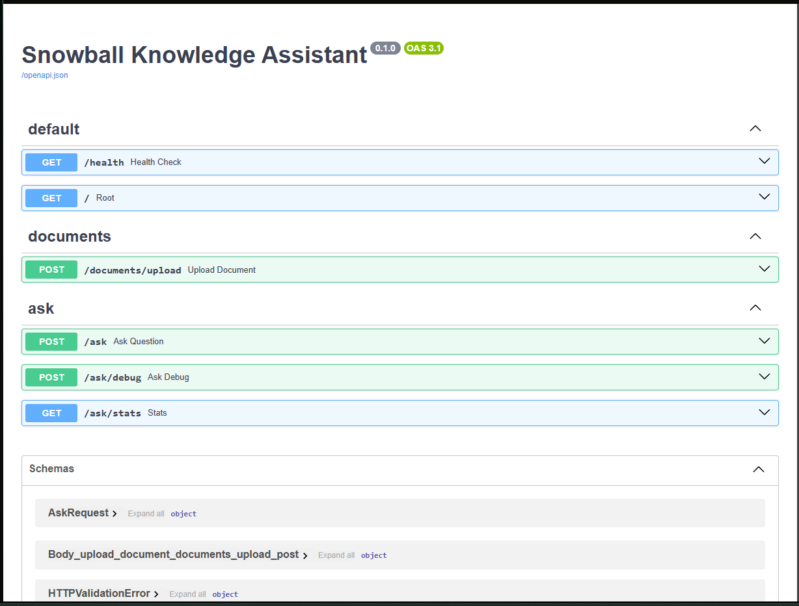
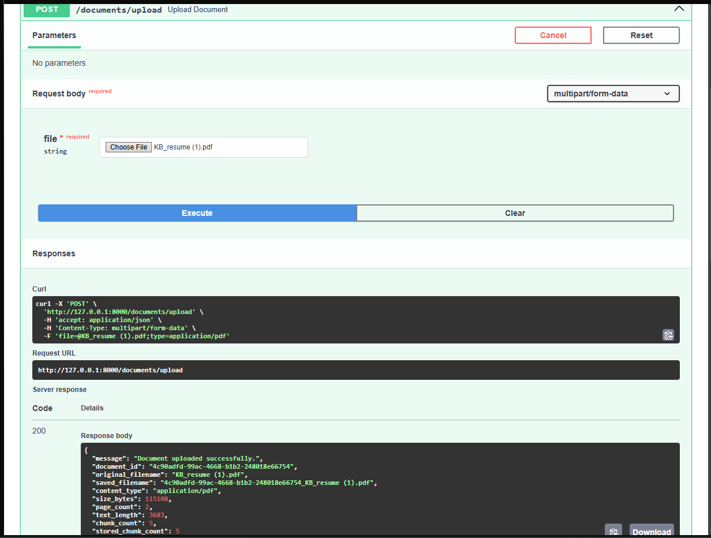
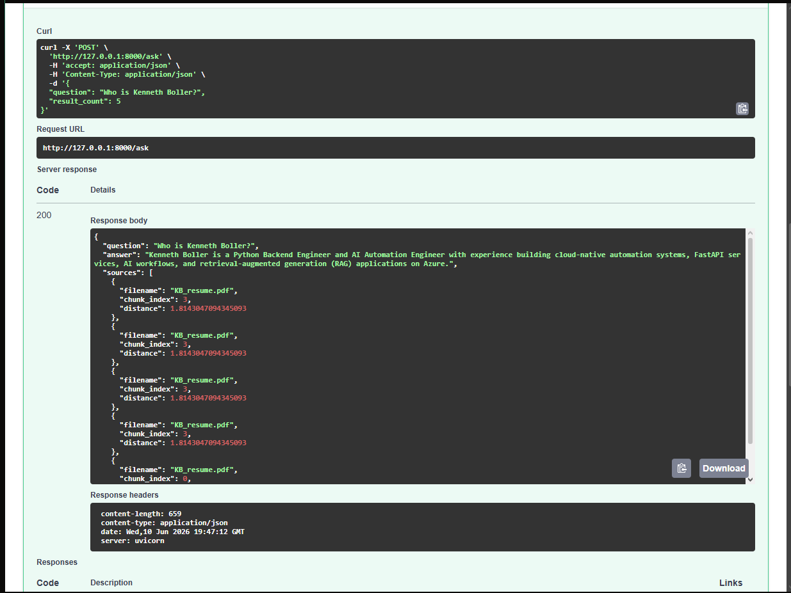
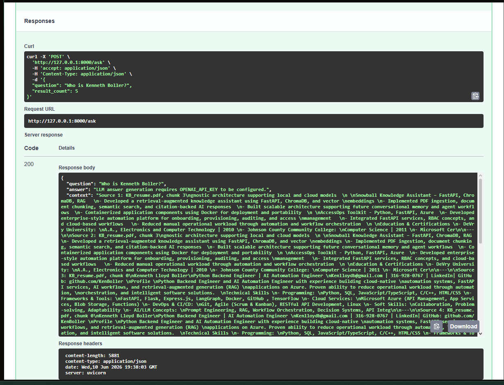

# ❄️ Snowball Knowledge Assistant

A FastAPI-powered Retrieval-Augmented Generation (RAG) knowledge assistant that ingests PDF documents, extracts and chunks text, generates embeddings, stores vectors in ChromaDB, and retrieves relevant context for question answering.

Built as a portfolio project to demonstrate modern AI application development using Python, FastAPI, vector databases, embeddings, semantic search, testing, and containerization.

---

## Screenshots

### Swagger API



### Upload Document



### Ask Question



### Returned Answer



---

## Features

### Document Processing
- Upload PDF documents through REST API
- Extract text using PyMuPDF
- Generate metadata for uploaded files
- Store uploaded documents locally

### Text Chunking
- Split large documents into manageable chunks
- Configurable chunk size and overlap
- Metadata tracking for source attribution

### Embeddings
- Generate vector embeddings from document chunks
- Local embeddings via Ollama
- Designed to support local embedding models in future versions

### Vector Database
- ChromaDB persistent vector storage
- Semantic similarity search
- Metadata-aware retrieval

### Retrieval
- Convert user questions into embeddings
- Search vector database for relevant chunks
- Return ranked results with source information

### API
- FastAPI backend
- Swagger/OpenAPI documentation
- Modular service architecture
- Automated test coverage

---

# Architecture

```text
                ┌───────────────┐
                │   PDF Upload  │
                └───────┬───────┘
                        │
                        ▼
              ┌──────────────────┐
              │ Text Extraction  │
              │     (PyMuPDF)    │
              └────────┬─────────┘
                       │
                       ▼
              ┌──────────────────┐
              │  Text Chunking   │
              └────────┬─────────┘
                       │
                       ▼
              ┌──────────────────┐
              │   Embeddings     │
              │    (Ollama)      │
              └────────┬─────────┘
                       │
                       ▼
              ┌──────────────────┐
              │     ChromaDB     │
              │ Vector Database  │
              └────────┬─────────┘
                       │
                       ▼
              ┌──────────────────┐
              │    Retrieval     │
              └────────┬─────────┘
                       │
                       ▼
              ┌──────────────────┐
              │   RAG Service    │
              └────────┬─────────┘
                       │
                       ▼
              ┌──────────────────┐
              │ Answer + Sources │
              └──────────────────┘
```

---

# Project Structure

```text
snowball-knowledge-assistant/
│
├── api/
│   ├── ask.py
│   ├── documents.py
│   └── health.py
│
├── app/
│   ├── config.py
│   └── main.py
│
├── services/
│   ├── chunking_service.py
│   ├── embedding_service.py
│   ├── pdf_service.py
│   ├── retrieval_service.py
│   ├── vector_service.py
│   └── rag_service.py
│
├── tests/
│   ├── test_chunking_service.py
│   ├── test_embedding_service.py
│   ├── test_health.py
│   ├── test_pdf_service.py
│   ├── test_retrieval_service.py
│   └── test_vector_service.py
│
├── uploads/
├── vectorstore/
├── chroma_store/
│
├── requirements.txt
├── Dockerfile
└── README.md
```

---

# Installation

Clone the repository:

```bash
git clone https://github.com/Fll0yd/snowball-knowledge-assistant.git
cd snowball-knowledge-assistant
```

Create a virtual environment:

```bash
python -m venv .venv
```

Activate:

Windows:

```bash
.venv\Scripts\activate
```

Install dependencies:

```bash
pip install -r requirements.txt
```

---

## Environment Variables

Optional:

```env
OLLAMA_MODEL=llama3.1
```

No OpenAI API key is required for local usage.

---

# Running Locally

Start the API:

```bash
uvicorn app.main:app --reload
```

Open Swagger UI:

```text
http://127.0.0.1:8000/docs
```

---

# API Endpoints

## Health Check

```http
GET /health
```

Response:

```json
{
  "status": "healthy"
}
```

---

## Upload Document

```http
POST /documents/upload
```

Upload a PDF document.

Example response:

```json
{
  "message": "Document uploaded successfully.",
  "document_id": "12345",
  "chunk_count": 3,
  "stored_chunk_count": 3
}
```

---

## Ask Question

```http
POST /ask
```

Example request:

```json
{
  "question": "Who is Kenneth Boller?",
  "result_count": 5
}
```

Current response:

```json
{
  "question": "Who is Kenneth Boller?",
  "answer": "Kenneth Boller is a Python Backend Engineer and AI Automation Engineer...",
  "sources": [
    {
      "filename": "KB_resume.pdf",
      "chunk_index": 3
    }
  ]
}
```

---

# Testing

Run all tests:

```bash
pytest
```

Current test coverage includes:

- PDF extraction
- Text chunking
- Embedding generation
- Vector storage
- Retrieval
- Health endpoint

Example:

```text
7 passed
```

---

# Current Status

Implemented:

- PDF Upload
- PDF Text Extraction
- Chunking
- Embeddings
- ChromaDB Storage
- Retrieval Service
- FastAPI API
- Swagger Documentation
- Automated Tests
- Full RAG Answer Generation
- Local LLM Integration (Ollama)

In Progress:

- Citation-Aware Responses
- Local Embedding Models
- Docker Validation

---

# Future Improvements

- Ollama Embeddings
- Local LLM Integration
- Citation-backed Answers
- Multi-document Collections
- Streaming Responses
- User Authentication
- Frontend Chat Interface

---

# Tech Stack

- Python
- FastAPI
- Local embeddings
- Ollama
- ChromaDB
- PyMuPDF
- Pytest
- Docker
- Uvicorn

---

# Author

**Kenneth Lloyd Boller**

Python Backend Developer | AI Automation | FastAPI | RAG Systems | SOC Automation

GitHub:
https://github.com/Fll0yd